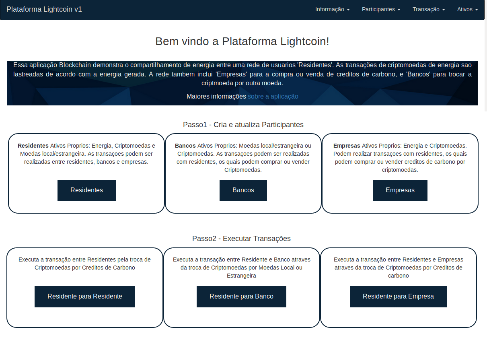

# Credito de Carbono Decentralizado

Com a crescente preocupação de desenvolvimento sustentável, e o futuro das próximas gerações, a comoditie de crédito de carbono tem se mostrado uma preocupação relevante diante da humanidade. Nosso trabalho visa a criação de uma plataforma em blockchain que seja referência no mercado de crédito de carbono.

* Cria uma rede de negócios em blockchain
* Desenvolve uma instância em Hyperledger Fabric
* Constroi um app angular para interagir com através do REST API


# Fluxo de Arquitetura

<p align="center">
  
</p>

1. The administrator interacts with Decentralized Energy UI comprising of Angular framework
2. The application processes user requests to the network through a REST API.
3. Implements requests to the Blockchain state database on Hyperledger Fabric v1
4. The REST API is used to retrieve the state of the database
5. The Angular framework gets the data through GET calls to the REST API

# Included Components

* Hyperledger Composer
* Angular Framework
* Loopback


# Running the Application
Follow these steps to setup and run this code pattern. The steps are described in detail below.

## Prerequisite
- Operating Systems: Ubuntu Linux 14.04 / 16.04 LTS (both 64-bit), or Mac OS 10.12
- [Docker](https://www.docker.com/) (Version 17.03 or higher)
- [npm](https://www.npmjs.com/)  (v5.x)
- [Node](https://nodejs.org/en/) (version 8.9 or higher - note version 9 is not supported)
  * to install specific Node version you can use [nvm](https://davidwalsh.name/nvm)
- [Hyperledger Composer](https://hyperledger.github.io/composer/installing/development-tools.html)
  * to install composer cli
    `npm install -g composer-cli`
  * to install composer-rest-server
    `npm install -g composer-rest-server`
  * to install generator-hyperledger-composer
    `npm install -g generator-hyperledger-composer`

## Steps
1. [Clone the repo](#1-clone-the-repo)
2. [Setup Fabric](#2-setup-fabric)
3. [Generate the Business Network Archive](#3-generate-the-business-network-archive)
4. [Deploy to Fabric](#4-deploy-to-fabric)
5. [Run Application](#5-run-application)
6. [Create Participants](#6-create-participants)
7. [Execute Transactions](#7-execute-transactions)

## 1. Clone the repo

Clone the `Decentralized-Energy-Composer code` locally. In a terminal, run:

```
git clone https://github.com/IBM/Decentralized-Energy-Composer
cd Decentralized-Energy-Composer
```

## 2. Setup Fabric

These commands will kill and remove all running containers, and should remove all previously created Hyperledger Fabric chaincode images:

```none
docker kill $(docker ps -q)
docker rm $(docker ps -aq)
docker rmi $(docker images dev-* -q)
```

All the scripts will be in the directory `/fabric-tools`.  Start fabric and create peer admin card:

```
cd fabric-tools/
./downloadFabric.sh
./startFabric.sh
./createPeerAdminCard.sh
```

## 3. Generate the Business Network Archive

Next generate the Business Network Archive (BNA) file from the root directory:

```
cd ../
npm install
```

The `composer archive create` command in `package.json` has created a file called `decentralized-energy-network@0.1.15.bna`.


## 4. Deploy to Fabric

Now, we are ready to deploy the business network to Hyperledger Fabric. This requires the Hyperledger Composer chaincode to be installed on the peer,then the business network archive (.bna) must be sent to the peer, and a new participant, identity, and associated card must be created to be the network administrator. Finally, the network administrator business network card must be imported for use, and the network can then be pinged to check it is responding.

First, install the business network:

```
composer network install --card PeerAdmin@hlfv1 --archiveFile decentralized-energy-network@0.1.15.bna
```

Start the business network:

```
composer network start --networkName decentralized-energy-network --networkVersion 0.1.15 --networkAdmin admin --networkAdminEnrollSecret adminpw --card PeerAdmin@hlfv1 --file networkadmin.card
```

Import the network administrator identity as a usable business network card:
```
composer card import --file networkadmin.card
```

Check that the business network has been deployed successfully, run the following command to ping the network:
```
composer network ping --card admin@decentralized-energy-network
```

## 5. Run Application

First, go into the `angular-app` folder and install the dependency:

```
cd angular-app/
npm install
```

To start the application:
```
npm start
```

The application should now be running at:
`http://localhost:4200`

<div style='border: 2px solid #f00;'>
  
</div>
</br>

The REST server to communicate with network is available here:
`http://localhost:3000/explorer/`


## 6. Create Participants

Once the application opens, create participants and fill in dummy data.  Create Residents, Banks and Utility Companies.


## 7. Execute Transactions

Execute transactions manually between Residents, Resident and Bank, and Resident and Utility Company.  After executing transactions, ensure the participants account values are updated.


At the end of your session, stop fabric:

```
cd ~/fabric-tools
./stopFabric.sh
./teardownFabric.sh
```

## Extending Code Pattern

This application demonstrates a basic idea of a decentralized energy network using Blockchain and can be expanded in several ways:
* Adding specific permissions and participant access
* Setting up real time transactions among participants
* Integrating with IoT to read from power meter and distribute energy

## Deploy to IBM Cloud

The blockchain network can be deployed to IBM Cloud. 
You can use the [IBM Blockchain platform](https://console.bluemix.net/catalog/services/blockchain) and start for free under `Starter Membership Plan`.  Follow [these instructions](https://console.bluemix.net/docs/services/blockchain/develop_starter.html#deploying-a-business-network) to deploy the business network to IBM Blockchain platform.

## Additional Resources
* [Hyperledger Fabric Docs](http://hyperledger-fabric.readthedocs.io/en/latest/)
* [Hyperledger Composer Docs](https://hyperledger.github.io/composer/latest/introduction/introduction.html)

## License
[Apache 2.0](LICENSE)
